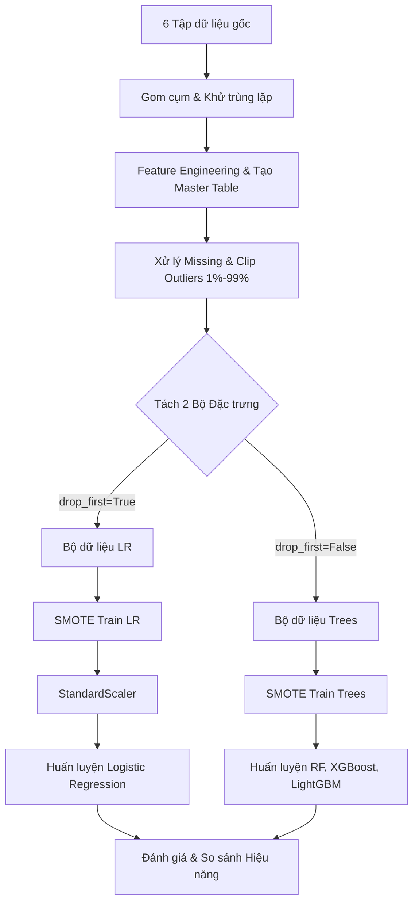

# Tài liệu Nghiên cứu & Tài liệu Kỹ thuật Dự án
## HỆ THỐNG CẢNH BÁO SỚM HÀNH VI ĐÁNH GIÁ TIÊU CỰC (OLIST EARLY WARNING SYSTEM)

Dự án này xây dựng một hệ thống máy học phân loại nhị phân (**Binary Classification**) nhằm cảnh báo sớm các đơn hàng có nguy cơ nhận đánh giá tiêu cực (1–3 sao) ngay khi đơn hàng chuyển sang trạng thái giao hàng thành công (`delivered`) trên nền tảng thương mại điện tử **Olist (Brazil)**. Từ đó, đội ngũ Chăm sóc khách hàng (CSKH) có thể chủ động can thiệp trước khi khách hàng viết đánh giá thực tế.

---

## 1. Phát biểu Bài toán & Kiến trúc Dữ liệu gốc
### 1.1. Đặt vấn đề & Mục tiêu (Business Problem)
*   **Thực trạng:** Olist kết nối hàng triệu người mua và người bán tại Brazil. Do đặc thù địa lý rộng lớn và logistics phức tạp, nhiều đơn hàng gặp sự cố giao chậm, phí vận chuyển cao, hoặc kích thước cồng kềnh, dẫn đến lượng đánh giá tiêu cực lớn.
*   **Hạn chế của phương pháp truyền thống:** Tiếp cận thụ động (chờ khách hàng đánh giá xấu rồi mới giải quyết) thường không hiệu quả trong việc giữ chân khách hàng (Customer Retention).
*   **Giải pháp đề xuất (Early Warning System):** Dự đoán xác suất khách hàng không hài lòng ngay tại thời điểm đơn hàng hoàn thành giao nhận (`order_delivered_customer_date`), cho phép doanh nghiệp phản ứng nhanh trong vòng "giờ vàng".

### 1.2. Biến mục tiêu (Target Definition)
Bài toán được định nghĩa dưới dạng phân loại nhị phân:
$$y = \begin{cases} 0 & \text{Trải nghiệm xấu (Review Score } \le 3\text{)} \\ 1 & \text{Hài lòng (Review Score } \ge 4\text{)} \end{cases}$$

### 1.3. Cấu trúc 6 Tập dữ liệu gốc (Data Schema)
Hệ thống tích hợp dữ liệu từ 6 bảng nguồn chính trong cơ sở dữ liệu của Olist:
1.  **Reviews** (99.224 dòng, 7 cột): Chứa điểm đánh giá, tiêu đề, và nội dung phản hồi của khách hàng.
2.  **Order Items** (112.650 dòng, 7 cột): Thông tin chi tiết sản phẩm trong đơn, giá bán, và phí ship.
3.  **Orders** (99.441 dòng, 8 cột): Quản lý các mốc thời gian của vòng đời đơn hàng và trạng thái đơn.
4.  **Payments** (103.886 dòng, 5 cột): Phương thức thanh toán, số kỳ trả góp, và số tiền thanh toán.
5.  **Products** (32.951 dòng, 9 cột): Trọng lượng, kích thước (dài, rộng, cao) và số lượng ảnh sản phẩm.
6.  **Customers** (99.441 dòng, 5 cột): Thông tin vị trí địa lý của khách hàng dựa trên Zipcode.

---

## 2. Quy trình Thực thi kỹ thuật & Giải pháp Công nghệ (Methodology)



### 2.1. Tiền xử lý dữ liệu nâng cao & Khử trùng lặp (Data Engineering)
*   **Giải quyết quan hệ 1-Nhiều:** Một đơn hàng có thể có nhiều sản phẩm và nhiều phương thức thanh toán. Nhóm thực hiện gom cụm (`groupby` theo `order_id`) trước khi tiến hành kết hợp bảng (`LEFT JOIN`), giúp tránh lỗi nhân bản đơn hàng (gây ảo số liệu doanh thu và phí ship).
*   **Xử lý tọa độ địa lý:** Tính toán tọa độ trung bình (vĩ độ/kinh độ) theo từng Zipcode để triệt tiêu sai số định vị.
*   **Xử lý trùng lặp Reviews:** Chỉ giữ lại bản ghi đánh giá mới nhất dựa trên mốc thời gian phản hồi thực tế của khách hàng.

### 2.2. Kỹ nghệ Đặc trưng (Feature Engineering)
Nhóm tự thiết lập 5 đặc trưng nghiệp vụ quan trọng dựa trên các giả thuyết kinh doanh thực tế:
1.  **`delivery_time` (Thời gian giao hàng):** Khoảng cách ngày từ lúc mua đến lúc nhận.
2.  **`delay_time` (Độ trễ giao hàng):** Số ngày giao hàng muộn hơn so với cam kết ước tính (nếu giao sớm hoặc đúng hạn thì gán bằng 0).
3.  **`product_volume` (Thể tích sản phẩm):** Dài $\times$ Rộng $\times$ Cao (cm³) đo lường độ cồng kềnh.
4.  **`freight_ratio` (Tỷ lệ chi phí vận chuyển):** Phí ship / Tổng chi phí đơn hàng. Đo lường mức độ "chặt chém" phí vận chuyển.
5.  **`haversine_distance` (Khoảng cách địa lý thực tế):** Tính khoảng cách đường cong mặt cầu (km) giữa người bán và người mua bằng công thức toán học Haversine từ tọa độ GPS.
*   *Bổ sung:* **`total_weight`** (Tổng khối lượng sản phẩm từ `product_weight_g`) và **`payment_type`** (Hành vi thanh toán của khách hàng).

### 2.3. Xử lý Trị khuyết & Outliers cực đoan
*   **Xử lý khuyết thiếu đặc trưng tỷ lệ:** Khi đơn hàng có tổng chi phí bằng 0, phép tính tỷ lệ phí ship tạo ra phép chia cho 0 (`NaN`). Nhóm xử lý bằng cách điền giá trị **Trung vị (Median)** của phân phối thay vì gán bằng 0 để giữ tính khách quan của dữ liệu.
*   **Kiểm soát Outliers cực đoan (Outlier Clipping):** Đối với 5 cột số liên tục (`delivery_time`, `delay_time`, `total_price`, `haversine_distance`, `total_weight`), nhóm tiến hành **co cụm (clip) về phân vị 1% và 99%**. Phương pháp này giúp loại bỏ hoàn toàn các giá trị dị biệt do sai số nhập liệu (ví dụ: giao hàng trễ hàng năm trời hoặc khoảng cách hàng chục nghìn cây số) mà không làm mất dòng dữ liệu gốc.

### 2.4. Thiết kế Pipeline Tách biệt Đặc trưng & Tránh rò rỉ dữ liệu (Anti-Data Leakage)
Để so sánh công bằng giữa mô hình tuyến tính (nhạy cảm với phân phối) và mô hình cây (bất biến với thang đo), nhóm thiết kế 2 nhánh xử lý dữ liệu độc lập:
*   **Nhánh 1 (Dành cho Logistic Regression):**
    *   One-Hot Encoding sử dụng tham số `drop_first=True` để loại bỏ 1 biến dummy đầu tiên, tránh hiện tượng đa cộng tuyến (multicollinearity) khiến mô hình tuyến tính bị lỗi ma trận hệ số.
    *   Chạy SMOTE trên tập Train để đưa tỷ lệ phân lớp về 50% / 50%.
    *   Áp dụng `StandardScaler` chuẩn hóa dữ liệu sau khi SMOTE để tránh phân phối của các điểm dữ liệu nhân tạo bị lệch.
*   **Nhánh 2 (Dành cho các mô hình dạng Cây - Random Forest, XGBoost, LightGBM):**
    *   One-Hot Encoding sử dụng tham số `drop_first=False` nhằm giữ trọn vẹn thông tin tất cả các phân lớp thuộc tính (mô hình cây rẽ nhánh độc lập nên không bị ảnh hưởng bởi đa cộng tuyến).
    *   Chạy SMOTE trên tập Train của nhánh này.
    *   Giữ nguyên dữ liệu ở dạng thô (unscaled) để tối ưu hóa khả năng rẽ nhánh của cây và duy trì tính trực quan dễ diễn giải của mô hình.

---

## 3. Phân tích Dữ liệu Khám phá (EDA - Key Insights)
*   **Về Độ trễ giao hàng (`delay_time`):** Biểu đồ Barplot chỉ ra nhóm đánh giá xấu (Class 0) có số ngày trễ trung bình cao vượt trội. Biểu đồ Boxplot (lọc riêng các đơn hàng thực sự bị trễ và ẩn outliers bằng `showfliers=False`) xác nhận sự khác biệt rất lớn về trung vị (Median) và khoảng biến thiên (IQR) giữa hai nhóm. Giao hàng trễ hẹn là nguyên nhân hàng đầu gây bất mãn.
*   **Về Phí vận chuyển (`freight_ratio`):** Nhóm đánh giá xấu có tỷ lệ phí vận chuyển chiếm trong hóa đơn cao hơn hẳn nhóm hài lòng, cho thấy mức độ nhạy cảm của khách hàng Brazil đối với chi phí ship hàng.
*   **Ma trận tương quan (Correlation Heatmap):** Hệ số tương quan giữa `delivery_time` và `delay_time` đạt khoảng $+0.72$ (dưới ngưỡng cảnh báo đa cộng tuyến nghiêm trọng $0.80$), do đó nhóm quyết định giữ lại cả hai để cung cấp đầy đủ thông tin nhất cho các mô hình học máy.

---

## 4. Kết quả Thực nghiệm & Đánh giá Mô hình
Sau khi huấn luyện song song và kiểm tra chéo trên tập Test thô (chứa dữ liệu thực tế 100%), hiệu năng của 4 mô hình đạt được như sau:

| Chỉ số Đánh giá | Logistic Regression | Random Forest | XGBoost | LightGBM (Chính thức) |
| :--- | :---: | :---: | :---: | :---: |
| **ROC-AUC** | 0.6622 | 0.6782 | 0.6812 | **0.6918** (Cao nhất) |
| **Accuracy** | 81% | 81% | 82% | **82%** (Cao nhất) |
| **Precision (Class 0)** | 63% | 58% | 65% | **69%** (Cao nhất) |
| **Recall (Class 0)** | 29% | **30%** (Cao nhất) | 28% | 27% |
| **Tốc độ Huấn luyện** | ⚡⚡⚡ | ⚡ | ⚡⚡ | ⚡⚡⚡ (Nhanh nhất) |

### Chiến lược Triển khai Hybrid tối ưu cho Doanh nghiệp:
1.  **Production Model (Mô hình chính): LightGBM**
    *   *Lý do:* Đạt điểm **Precision của lớp xấu cao nhất (69%)**, giảm tối đa tỷ lệ báo động sai (False Alarm). Điều này giúp doanh nghiệp tiết kiệm chi phí vận hành CSKH, tránh liên hệ làm phiền những khách hàng thực chất vẫn đang hài lòng.
2.  **Fallback Model (Mô hình dự phòng): Random Forest**
    *   *Lý do:* Đạt điểm **Recall của lớp xấu cao nhất (30%)**. Mô hình này sẽ được kích hoạt vào các giai đoạn thấp điểm hoặc khi bộ phận CSKH có dư thừa năng lực xử lý đơn hàng, nhằm quét và giữ chân tối đa tệp khách hàng có nguy cơ rời bỏ nền tảng.

---

## 5. Hướng dẫn Chạy chương trình (Deployment Guide)
### Bước 1: Chuẩn bị môi trường và Cài đặt thư viện
Mở cửa sổ dòng lệnh tại thư mục dự án và cài đặt các thư viện cần thiết:
```bash
pip install -r requirements.txt
```

### Bước 2: Chạy kiểm thử hệ thống Pipeline
Mở và chạy toàn bộ các Cell trong file Jupyter Notebook chính:
```text
Olist_Early_Warning_System.ipynb
```
Notebook được thiết kế chạy từ đầu đến cuối một cách tuần tự (`Restart & Run All`) mà không phát sinh lỗi runtime, tự động kết xuất các biểu đồ trực quan hóa và bảng so sánh hiệu năng.


